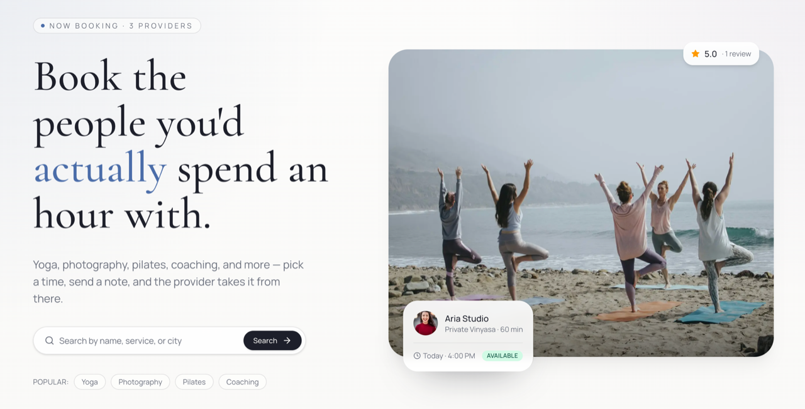

# InsForge Booking

A two-sided booking marketplace built with Next.js, Tailwind CSS, and InsForge — customers discover providers, request appointments at open time slots, exchange messages, and leave reviews after the session is complete.

**[Features](#features)** · **[Demo](#demo)** · **[Quick Launch](#quick-launch)** · **[Run locally](#run-locally)** · **[Deploy to Vercel](#deploy-to-vercel)** · **[First Try](#first-try)** · **[Customize](#customize)**



The starter ships with a public provider directory, individual provider pages with services and reviews, an availability-aware booking flow, customer and provider dashboards, per-booking messaging, and the schema + RLS + seeded data needed to run it from one migration file.

## Features

- Seeded marketplace with three sample providers, nine services, weekly availability, and a completed review
- Provider directory with search, individual provider pages with services and ratings
- Availability-aware booking flow (weekly windows + blackouts + double-booking guard)
- Customer dashboard for upcoming/past bookings, cancellations, and reviews after completion
- Provider dashboard for services CRUD, weekly schedule + blackouts editor, and accept/decline/complete actions
- Per-booking messaging thread scoped by Row Level Security to the two participants
- [InsForge](https://insforge.dev) authentication, database, storage, and Row Level Security
- Built with [Next.js](https://nextjs.org), React 19, and [Tailwind CSS](https://tailwindcss.com)

## Demo

Demo: _coming soon_

The live demo includes the seeded marketplace, a public provider directory, individual provider pages, the booking flow, and both customer and provider dashboards so you can evaluate the starter before making any changes.

## Quick Launch

If you want the fastest path, use the InsForge CLI and follow the prompts:

```bash
npx @insforge/cli create
```

From there:

1. Choose the booking template
2. Create or connect your InsForge project
3. Let the CLI set up the project files
4. Choose to deploy with [InsForge](https://insforge.dev) automatically from the guided flow

Use the local setup below if you want to inspect the repo, edit environment variables manually, or control the setup step by step.

## Run locally

1. Clone the repository and move into the booking template:

   ```bash
   git clone https://github.com/InsForge/insforge-templates.git
   cd insforge-templates/booking
   ```

2. Install dependencies:

   ```bash
   npm install
   ```

3. Go to the [InsForge dashboard](https://insforge.dev), create a project, and click **Connect** → **CLI** to get the link command:

   ```bash
   npx @insforge/cli link --project-id <your-project-id>
   ```

4. Copy the example environment file:

   ```bash
   cp .env.example .env.local
   ```

5. Fill in the required values (find these in the InsForge dashboard under **Connect** → **API Keys**):

   ```env
   NEXT_PUBLIC_INSFORGE_URL=https://your-project.region.insforge.app
   NEXT_PUBLIC_INSFORGE_ANON_KEY=your-anon-key
   NEXT_PUBLIC_APP_URL=http://localhost:3000
   ```

6. Apply the included schema and seed data to your InsForge project. You can either ask your agent using this prompt:

   > help me create tables and seed data from migrations/db_init.sql

   Or run the command directly:

   ```bash
   npx @insforge/cli db query -- "$(cat migrations/db_init.sql)"
   ```

   This migration creates eight tables (profiles, providers, services, availabilities, blackouts, bookings, booking_messages, reviews), Row Level Security policies for every table, a rating-aggregation trigger, and a seeded marketplace with three providers and nine services.

7. Create the storage buckets used for provider and service uploads:

   ```bash
   npm run setup
   ```

8. Start the dev server:

   ```bash
   npm run dev
   ```

9. Open [http://localhost:3000](http://localhost:3000)

## Deploy to Vercel

After cloning the repo and running the starter locally, you can deploy it on Vercel:

[](https://vercel.com/new/clone?repository-url=https%3A%2F%2Fgithub.com%2FInsForge%2Finsforge-templates%2Ftree%2Fmain%2Fbooking&root-directory=booking&project-name=insforge-booking&repository-name=insforge-booking&env=NEXT_PUBLIC_INSFORGE_URL,NEXT_PUBLIC_INSFORGE_ANON_KEY&envDescription=Connect%20your%20InsForge%20project%20URL%20and%20anon%20key.)

1. Set `NEXT_PUBLIC_INSFORGE_URL`
2. Set `NEXT_PUBLIC_INSFORGE_ANON_KEY`
3. Deploy the project
4. In Vercel, open your project, go to `Settings` → `Environment Variables`, and set `NEXT_PUBLIC_APP_URL` to your deployed app URL
5. Redeploy the project
6. In the InsForge dashboard, open `Authentication` → `General` → `Allowed Redirect URLs`, then add:
   - `http://localhost:3000/auth/callback`
   - `https://your-project.vercel.app/auth/callback`

## First Try

After the migration runs, open the home page to see the seeded providers, then drill into a provider profile to scan their services and weekly hours. Sign up, request a booking on any service, and check `/account/bookings` to see it in `pending` state. Then sign in as a different user (or run the booking through a separate provider account) and accept/decline from the provider dashboard at `/dashboard/bookings`. After a booking is marked completed, the customer can leave a review.

## Customize

- Swap the seeded provider list with your own categories or vertical (tutoring, salons, photographers, consultants).
- Change `lib/constants.ts` to adjust slot granularity, booking cutoff, or naming.
- Tighten the availability algorithm in `lib/availability.ts` if you need different rules (buffer time, longer horizons, holiday overrides).
- Add Stripe via the InsForge payments module if you want to capture a deposit at booking time instead of letting providers run their own payment process.

## Notes

- The seeded marketplace uses fixed demo UUIDs for `user_id`, so the public pages render correctly before any real user signs up. Real users get their own provider/booking rows on top of this seed data.
- Availability is computed in the provider's timezone (`providers.timezone`), converted to UTC for storage and comparison.
- Double-booking is prevented at the database level via a partial unique index on `(provider_id, start_at) WHERE status IN ('pending', 'confirmed')`.
- Per-booking messages and customer reviews are visible only to authorized roles via Row Level Security — see `migrations/db_init.sql` for the policies.
- The app uses server-side [InsForge](https://insforge.dev) SDK calls with `httpOnly` auth cookies.
